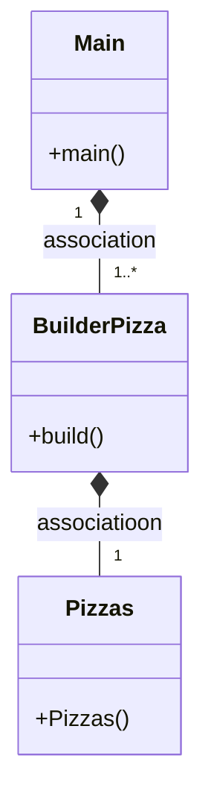

#¿Que es el Patron Builder?

El patrón Builder es un patrón de diseño que se utiliza para crear objetos complejos paso a paso y permitir que el usuario final pueda personalizar el proceso de construcción sin conocer todos los detalles de su implementación.

#¿Podríamos combinarlo con el patrón Factory?

Sí, es posible combinar el Builder Factory con el Patron Fractory

#Marckdown

